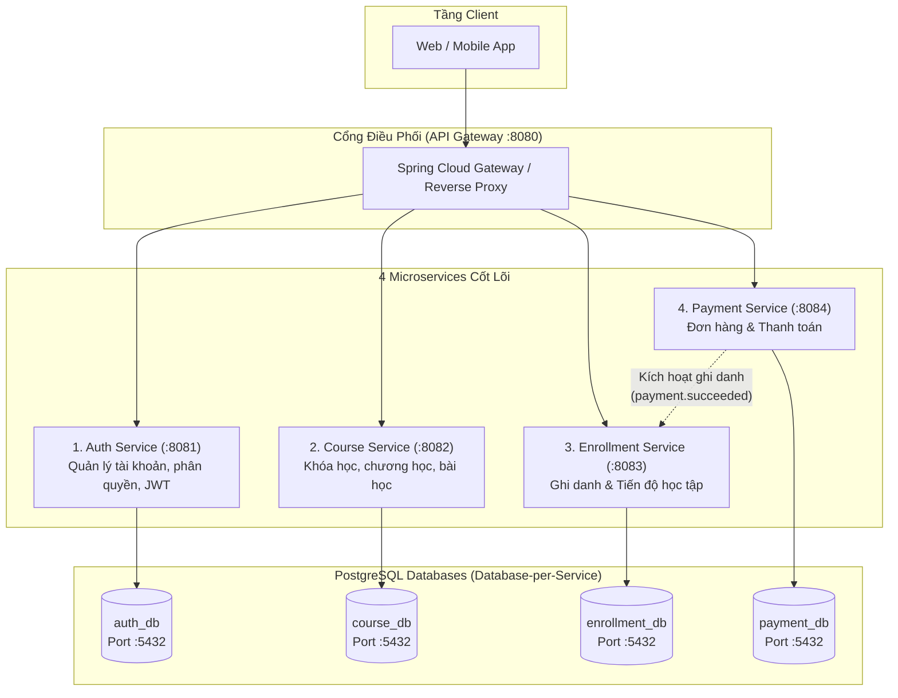
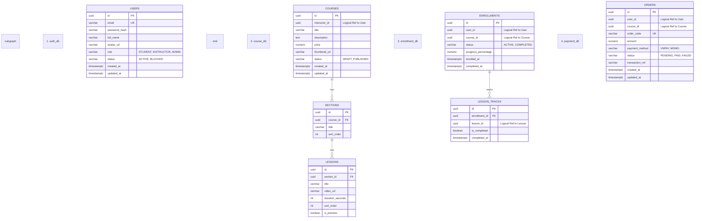
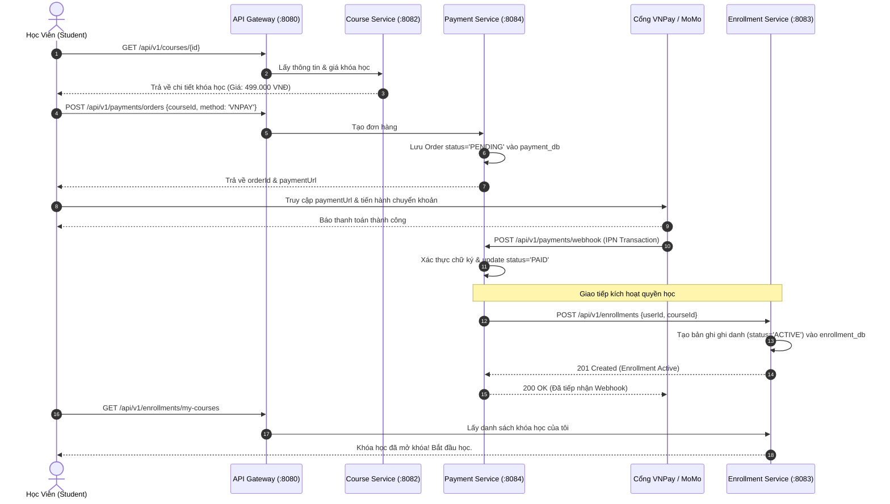

# THIẾT KẾ KIẾN TRÚC 4 MICROSERVICES QUẢN LÝ KHÓA HỌC (E-LEARNING LMS)

---

## MỤC LỤC
1. [Tổng Quan 4 Dịch Vụ Cốt Lõi](#1-tổng-quan-4-dịch-vụ-cốt-lõi)
2. [Tiêu Chuẩn Công Nghệ & Hạ Tầng](#2-tiêu-chuẩn-công-nghệ--hạ-tầng)
3. [Cấu Trúc Thư Mục & Package Chuẩn](#3-cấu-trúc-thư-mục--package-chuẩn)
4. [Mẫu Cấu Hình Build (Gradle) & Application Properties](#4-mẫu-cấu-hình-build-gradle--application-properties)
5. [Đặc Tả Các API Chính Của 4 Dịch Vụ](#5-đặc-tả-các-api-chính-của-4-dịch-vụ)
6. [Thiết Kế Cơ Sở Dữ Liệu PostgreSQL (4 DB Tách Biệt)](#6-thiết-kế-cơ-sở-dữ-liệu-postgresql-4-db-tách-biệt)
7. [Luồng Nghiệp Vụ Cốt Lõi (Sequence Diagram)](#7-luồng-nghiệp-vụ-cốt-lõi-sequence-diagram)

---

## 1. TỔNG QUAN 4 DỊCH VỤ CỐT LÕI

Hệ thống được tinh gọn tối đa vào **4 Microservices quan trọng nhất**, mỗi dịch vụ chịu trách nhiệm một Bounded Context độc lập, sở hữu Database riêng biệt và giao tiếp qua REST/Event:



| STT | Tên Service | Port | Database PostgreSQL | Trách nhiệm chính |
| :---: | :--- | :---: | :--- | :--- |
| **1** | **Auth Service** | `8081` | `auth_db` | Đăng ký, đăng nhập, cấp/xác thực JWT token, phân quyền (ADMIN, INSTRUCTOR, STUDENT). |
| **2** | **Course Service** | `8082` | `course_db` | Danh mục, thông tin khóa học, chương học (Sections), bài học (Lessons). |
| **3** | **Enrollment Service**| `8083` | `enrollment_db` | Quyền học, ghi danh, theo dõi % hoàn thành, đánh dấu bài học đã xem. |
| **4** | **Payment Service** | `8084` | `payment_db` | Khởi tạo đơn hàng, tạo link thanh toán, xử lý callback thanh toán thành công. |

---

## 2. TIÊU CHUẨN CÔNG NGHỆ & HẠ TẦNG

- **Java Development Kit (JDK)**: **JDK 17 LTS**
- **Framework**: **Spring Boot 3.x / 4.x** (Jakarta EE 10, Spring Framework 6.x / 7.x)
- **Build Tool**: **Gradle** kèm **Gradle Wrapper (`gradlew`, `gradlew.bat`)**
- **File Cấu Hình**: **`application.properties`** (Không dùng YAML)
- **Hệ Quản Trị CSDL**: **PostgreSQL 15+** (Mỗi service kết nối database riêng biệt)
- **Data Access & Migration**: Spring Data JPA, Hibernate, Flyway / Liquibase (tùy chọn)
- **Xác Thực**: Spring Security, JJWT (Java JWT)

---

## 3. CẤU TRÚC THƯ MỤC & PACKAGE CHUẨN

Cả 4 microservice đều tuân thủ kiến trúc phân tầng (Layered Architecture) đồng nhất:

```plaintext
<service-name>/
├── gradle/
│   └── wrapper/
│       ├── gradle-wrapper.jar
│       └── gradle-wrapper.properties
├── src/
│   ├── main/
│   │   ├── java/
│   │   │   └── com/
│   │   │       └── elearning/
│   │   │           └── <servicename>/
│   │   │               ├── config/            # Cấu hình Security, WebMvc, Bean,...
│   │   │               ├── constant/          # Enum, ErrorCode, Message constants
│   │   │               ├── controller/        # REST APIs tiếp nhận request
│   │   │               ├── dto/               # Data Transfer Objects
│   │   │               │   ├── request/       # Request body DTOs (@Valid)
│   │   │               │   └── response/      # Response DTOs, ApiResponse<T>
│   │   │               ├── entity/            # JPA Entities ánh xạ bảng PostgreSQL
│   │   │               ├── exception/         # Custom Exceptions & GlobalExceptionHandler
│   │   │               ├── repository/        # Spring Data JPA Repositories
│   │   │               ├── service/           # Service Interfaces
│   │   │               │   └── impl/          # Service Implementations
│   │   │               └── <ServiceName>Application.java
│   │   └── resources/
│   │       └── application.properties         # File cấu hình dạng properties
│   └── test/
├── build.gradle                               # Script build Gradle
├── settings.gradle
├── gradlew
└── gradlew.bat
```

### Ý nghĩa từng package:
1. **`config/`**: Khai báo các Bean toàn cục, cấu hình Spring Security, CORS, PasswordEncoder, ObjectMapper.
2. **`constant/`**: Chứa các hằng số, Enum trạng thái (`Role`, `CourseStatus`, `OrderStatus`, `PaymentStatus`).
3. **`controller/`**: Chứa các lớp `@RestController`, định nghĩa endpoints, map HTTP methods (GET/POST/PUT/DELETE).
4. **`dto/request/`**: Đối tượng hứng dữ liệu từ Client gửi lên, gắn annotation xác thực (`@NotBlank`, `@NotNull`, `@Min`).
5. **`dto/response/`**: Đối tượng chuẩn hóa dữ liệu trả về cho Client, kèm lớp bọc chuẩn `ApiResponse<T>`.
6. **`entity/`**: Các entity JPA `@Entity` đại diện cho các bảng trong database PostgreSQL của riêng service đó.
7. **`exception/`**: Chứa các exception tùy biến (`AppException`, `ResourceNotFoundException`) và `@RestControllerAdvice` để bắt lỗi toàn cục.
8. **`repository/`**: Kế thừa `JpaRepository<Entity, ID>` để thực hiện truy vấn dữ liệu.
9. **`service/` & `service.impl/`**: Xử lý toàn bộ logic nghiệp vụ, giao dịch `@Transactional`.

---

## 4. MẪU CẤU HÌNH BUILD (GRADLE) & APPLICATION PROPERTIES

### 4.1. File `build.gradle` Chuẩn (JDK 17 + Spring Boot + PostgreSQL)
Dùng chung làm template cho các service:

```groovy
plugins {
    id 'java'
    id 'org.springframework.boot' version '3.3.4' // Hoặc Spring Boot 4.0 khi khả dụng
    id 'io.spring.dependency-management' version '1.1.6'
}

group = 'com.elearning'
version = '1.0.0-SNAPSHOT'

java {
    toolchain {
        languageVersion = JavaLanguageVersion.of(17)
    }
}

configurations {
    compileOnly {
        extendsFrom annotationProcessor
    }
}

repositories {
    mavenCentral()
}

dependencies {
    // Spring Boot Starters
    implementation 'org.springframework.boot:spring-boot-starter-web'
    implementation 'org.springframework.boot:spring-boot-starter-data-jpa'
    implementation 'org.springframework.boot:spring-boot-starter-validation'
    implementation 'org.springframework.boot:spring-boot-starter-security'

    // PostgreSQL Driver
    runtimeOnly 'org.postgresql:postgresql'

    // JWT (JJWT)
    implementation 'io.jsonwebtoken:jjwt-api:0.12.6'
    runtimeOnly 'io.jsonwebtoken:jjwt-impl:0.12.6'
    runtimeOnly 'io.jsonwebtoken:jjwt-jackson:0.12.6'

    // Lombok (Tùy chọn giúp rút gọn Boilerplate)
    compileOnly 'org.projectlombok:lombok'
    annotationProcessor 'org.projectlombok:lombok'

    // Testing
    testImplementation 'org.springframework.boot:spring-boot-starter-test'
}

tasks.named('test') {
    useJUnitPlatform()
}
```

---

### 4.2. File `application.properties` Mẫu Cho Từng Service

#### 🟢 Service 1: `auth-service/src/main/resources/application.properties`
```properties
# Server Configuration
server.port=8081
server.servlet.context-path=/api/v1/auth

# Application Information
spring.application.name=auth-service

# PostgreSQL Database Configuration
spring.datasource.url=jdbc:postgresql://localhost:5432/auth_db
spring.datasource.username=postgres
spring.datasource.password=postgres
spring.datasource.driver-class-name=org.postgresql.Driver

# JPA / Hibernate Configuration
spring.jpa.hibernate.ddl-auto=update
spring.jpa.show-sql=true
spring.jpa.properties.hibernate.format_sql=true
spring.jpa.properties.hibernate.dialect=org.hibernate.dialect.PostgreSQLDialect

# JWT Configuration
jwt.secret-key=404E635266556A586E3272357538782F413F4428472B4B6250645367566B5970
jwt.access-token-expiration-ms=86400000
jwt.refresh-token-expiration-ms=604800000
```

#### 🔵 Service 2: `course-service/src/main/resources/application.properties`
```properties
# Server Configuration
server.port=8082
server.servlet.context-path=/api/v1/courses

# Application Information
spring.application.name=course-service

# PostgreSQL Database Configuration
spring.datasource.url=jdbc:postgresql://localhost:5432/course_db
spring.datasource.username=postgres
spring.datasource.password=postgres
spring.datasource.driver-class-name=org.postgresql.Driver

# JPA / Hibernate Configuration
spring.jpa.hibernate.ddl-auto=update
spring.jpa.show-sql=true
spring.jpa.properties.hibernate.format_sql=true
spring.jpa.properties.hibernate.dialect=org.hibernate.dialect.PostgreSQLDialect
```

#### 🟣 Service 3: `enrollment-service/src/main/resources/application.properties`
```properties
# Server Configuration
server.port=8083
server.servlet.context-path=/api/v1/enrollments

# Application Information
spring.application.name=enrollment-service

# PostgreSQL Database Configuration
spring.datasource.url=jdbc:postgresql://localhost:5432/enrollment_db
spring.datasource.username=postgres
spring.datasource.password=postgres
spring.datasource.driver-class-name=org.postgresql.Driver

# JPA / Hibernate Configuration
spring.jpa.hibernate.ddl-auto=update
spring.jpa.show-sql=true
spring.jpa.properties.hibernate.format_sql=true
spring.jpa.properties.hibernate.dialect=org.hibernate.dialect.PostgreSQLDialect
```

#### 🟠 Service 4: `payment-service/src/main/resources/application.properties`
```properties
# Server Configuration
server.port=8084
server.servlet.context-path=/api/v1/payments

# Application Information
spring.application.name=payment-service

# PostgreSQL Database Configuration
spring.datasource.url=jdbc:postgresql://localhost:5432/payment_db
spring.datasource.username=postgres
spring.datasource.password=postgres
spring.datasource.driver-class-name=org.postgresql.Driver

# JPA / Hibernate Configuration
spring.jpa.hibernate.ddl-auto=update
spring.jpa.show-sql=true
spring.jpa.properties.hibernate.format_sql=true
spring.jpa.properties.hibernate.dialect=org.hibernate.dialect.PostgreSQLDialect

# Internal Service URLs
services.enrollment.base-url=http://localhost:8083/api/v1/enrollments
```

---

## 5. ĐẶC TẢ CÁC API CHÍNH CỦA 4 DỊCH VỤ

Chuẩn format phản hồi chung của hệ thống:
```json
{
  "code": 200,
  "message": "Thành công",
  "data": { ... }
}
```

---

### 5.1. DỊCH VỤ 1: AUTH SERVICE (Cổng 8081)

#### API 1.1: Đăng Ký Tài Khoản Mới
- **Endpoint**: `POST /api/v1/auth/register`
- **Quyền**: Public
- **Request Body (`RegisterRequest`)**:
```json
{
  "email": "student@example.com",
  "password": "Password123@",
  "fullName": "Nguyen Van A",
  "role": "STUDENT"
}
```
- **Response (`201 Created` - `AuthResponse`)**:
```json
{
  "code": 201,
  "message": "Đăng ký tài khoản thành công",
  "data": {
    "userId": "c7a10243-7f21-4fce-bc01-e612f067d021",
    "email": "student@example.com",
    "fullName": "Nguyen Van A",
    "role": "STUDENT"
  }
}
```

#### API 1.2: Đăng Nhập & Cấp JWT Token
- **Endpoint**: `POST /api/v1/auth/login`
- **Quyền**: Public
- **Request Body (`LoginRequest`)**:
```json
{
  "email": "student@example.com",
  "password": "Password123@"
}
```
- **Response (`200 OK` - `LoginResponse`)**:
```json
{
  "code": 200,
  "message": "Đăng nhập thành công",
  "data": {
    "accessToken": "eyJhbGciOiJIUzI1NiIsInR5cCI6IkpXVCJ9...",
    "tokenType": "Bearer",
    "expiresIn": 86400,
    "user": {
      "userId": "c7a10243-7f21-4fce-bc01-e612f067d021",
      "email": "student@example.com",
      "role": "STUDENT"
    }
  }
}
```

#### API 1.3: Lấy Thông Tin Cá Nhân
- **Endpoint**: `GET /api/v1/auth/me`
- **Quyền**: Yêu cầu Header `Authorization: Bearer <accessToken>`
- **Response (`200 OK` - `UserProfileResponse`)**:
```json
{
  "code": 200,
  "message": "Lấy thông tin thành công",
  "data": {
    "userId": "c7a10243-7f21-4fce-bc01-e612f067d021",
    "email": "student@example.com",
    "fullName": "Nguyen Van A",
    "avatarUrl": "https://cdn.example.com/avatars/user.jpg",
    "role": "STUDENT"
  }
}
```

---

### 5.2. DỊCH VỤ 2: COURSE SERVICE (Cổng 8082)

#### API 2.1: Lấy Danh Sách Khóa Học (Có Tìm Kiếm & Phân Trang)
- **Endpoint**: `GET /api/v1/courses?page=0&size=10&keyword=Java`
- **Quyền**: Public
- **Response (`200 OK` - `PageResponse<CourseSummaryResponse>`)**:
```json
{
  "code": 200,
  "message": "Lấy danh sách khóa học thành công",
  "data": {
    "items": [
      {
        "id": "9b1deb4d-3b7d-4bad-9bdd-2b0d7b3dcb6d",
        "title": "Lập trình Microservices với Spring Boot",
        "thumbnailUrl": "https://cdn.example.com/courses/spring.jpg",
        "price": 499000.0,
        "instructorName": "Tran Van B",
        "status": "PUBLISHED"
      }
    ],
    "page": 0,
    "size": 10,
    "totalElements": 1,
    "totalPages": 1
  }
}
```

#### API 2.2: Xem Chi Tiết Khóa Học & Đề Cương (Curriculum)
- **Endpoint**: `GET /api/v1/courses/{id}`
- **Quyền**: Public
- **Response (`200 OK` - `CourseDetailResponse`)**:
```json
{
  "code": 200,
  "message": "Chi tiết khóa học",
  "data": {
    "id": "9b1deb4d-3b7d-4bad-9bdd-2b0d7b3dcb6d",
    "title": "Lập trình Microservices với Spring Boot",
    "description": "Khóa học từ cơ bản đến nâng cao về Spring Cloud & Docker.",
    "price": 499000.0,
    "instructorId": "8f8c9b9a-4c2d-419b-b51c-057d2a58b091",
    "sections": [
      {
        "sectionId": "a1b2c3d4-0001-4000-8000-000000000001",
        "title": "Chương 1: Tổng quan Microservices",
        "lessons": [
          {
            "lessonId": "b1b2c3d4-0002-4000-8000-000000000002",
            "title": "Bài 1: Kiến trúc Monolith vs Microservices",
            "durationSeconds": 600,
            "isPreview": true
          }
        ]
      }
    ]
  }
}
```

#### API 2.3: Tạo Khóa Học Mới
- **Endpoint**: `POST /api/v1/courses`
- **Quyền**: `INSTRUCTOR`, `ADMIN`
- **Request Body (`CreateCourseRequest`)**:
```json
{
  "title": "Lập trình Microservices với Spring Boot",
  "description": "Khóa học từ cơ bản đến nâng cao",
  "price": 499000.0,
  "thumbnailUrl": "https://cdn.example.com/courses/spring.jpg"
}
```
- **Response (`201 Created`)**: Trả về `CourseDetailResponse` kèm `id` vừa tạo.

#### API 2.4: Thêm Bài Học Mới Vào Khóa Học
- **Endpoint**: `POST /api/v1/courses/sections/{sectionId}/lessons`
- **Quyền**: `INSTRUCTOR`, `ADMIN`
- **Request Body (`CreateLessonRequest`)**:
```json
{
  "title": "Bài 2: Thiết kế API Gateway",
  "videoUrl": "https://cdn.example.com/videos/lesson-2.mp4",
  "durationSeconds": 1200,
  "sortOrder": 2,
  "isPreview": false
}
```
- **Response (`201 Created`)**: Trả về chi tiết bài học vừa thêm.

---

### 5.3. DỊCH VỤ 3: ENROLLMENT & PROGRESS SERVICE (Cổng 8083)

#### API 3.1: Ghi Danh Khóa Học (Tạo Quyền Học)
- **Endpoint**: `POST /api/v1/enrollments`
- **Quyền**: Nội bộ (Internal Gọi từ Payment Service) hoặc Học viên (với khóa học miễn phí)
- **Request Body (`EnrollmentCreateRequest`)**:
```json
{
  "userId": "c7a10243-7f21-4fce-bc01-e612f067d021",
  "courseId": "9b1deb4d-3b7d-4bad-9bdd-2b0d7b3dcb6d"
}
```
- **Response (`201 Created` - `EnrollmentResponse`)**:
```json
{
  "code": 201,
  "message": "Ghi danh khóa học thành công",
  "data": {
    "enrollmentId": "e1f2a3b4-1111-4000-8000-000000000001",
    "userId": "c7a10243-7f21-4fce-bc01-e612f067d021",
    "courseId": "9b1deb4d-3b7d-4bad-9bdd-2b0d7b3dcb6d",
    "status": "ACTIVE",
    "progressPercentage": 0.0,
    "enrolledAt": "2026-10-07T18:00:00Z"
  }
}
```

#### API 3.2: Lấy Danh Sách Khóa Học Của Học Viên Đang Đăng Nhập
- **Endpoint**: `GET /api/v1/enrollments/my-courses`
- **Quyền**: `STUDENT`
- **Response (`200 OK` - `List<MyCourseResponse>`)**:
```json
{
  "code": 200,
  "message": "Lấy danh sách khóa học đã ghi danh",
  "data": [
    {
      "enrollmentId": "e1f2a3b4-1111-4000-8000-000000000001",
      "courseId": "9b1deb4d-3b7d-4bad-9bdd-2b0d7b3dcb6d",
      "status": "ACTIVE",
      "progressPercentage": 35.5,
      "enrolledAt": "2026-10-07T18:00:00Z"
    }
  ]
}
```

#### API 3.3: Đánh Dấu Hoàn Thành Bài Học & Cập Nhật Tiến Độ
- **Endpoint**: `PUT /api/v1/enrollments/courses/{courseId}/lessons/{lessonId}/complete`
- **Quyền**: `STUDENT`
- **Response (`200 OK` - `ProgressUpdateResponse`)**:
```json
{
  "code": 200,
  "message": "Đã cập nhật tiến độ bài học",
  "data": {
    "courseId": "9b1deb4d-3b7d-4bad-9bdd-2b0d7b3dcb6d",
    "lessonId": "b1b2c3d4-0002-4000-8000-000000000002",
    "isCompleted": true,
    "currentProgressPercentage": 50.0,
    "isCourseCompleted": false
  }
}
```

---

### 5.4. DỊCH VỤ 4: PAYMENT & ORDER SERVICE (Cổng 8084)

#### API 4.1: Tạo Đơn Hàng Mua Khóa Học
- **Endpoint**: `POST /api/v1/payments/orders`
- **Quyền**: `STUDENT`
- **Request Body (`CreateOrderRequest`)**:
```json
{
  "courseId": "9b1deb4d-3b7d-4bad-9bdd-2b0d7b3dcb6d",
  "paymentMethod": "VNPAY"
}
```
- **Response (`201 Created` - `OrderResponse`)**:
```json
{
  "code": 201,
  "message": "Tạo đơn hàng thành công",
  "data": {
    "orderId": "d1d2d3d4-2222-4000-8000-000000000001",
    "orderCode": "ORD202610070001",
    "totalAmount": 499000.0,
    "status": "PENDING",
    "paymentUrl": "https://sandbox.vnpayment.vn/paymentv2/vpcpay.html?orderId=ORD202610070001&...",
    "createdAt": "2026-10-07T18:15:00Z"
  }
}
```

#### API 4.2: Webhook Nhận Kết Quả Thanh Toán Từ Cổng Thanh Toán
- **Endpoint**: `POST /api/v1/payments/webhook`
- **Quyền**: Public (Xác thực chữ ký số HMAC của bên thứ 3)
- **Request Body (`PaymentWebhookRequest`)**:
```json
{
  "orderCode": "ORD202610070001",
  "transactionNo": "VNPAY14829102",
  "responseCode": "00",
  "secureHash": "3f4a8b7c9e1d2f0a..."
}
```
- **Logic thực thi**:
  1. Verify chữ ký `secureHash`.
  2. Cập nhật Order status thành `PAID`.
  3. Gọi sang **Enrollment Service** (`POST /api/v1/enrollments`) để kích hoạt khóa học cho học viên.
- **Response (`200 OK`)**:
```json
{
  "code": 200,
  "message": "Xử lý kết quả thanh toán thành công",
  "data": {
    "orderCode": "ORD202610070001",
    "status": "PAID"
  }
}
```

#### API 4.3: Kiểm Tra Trạng Thái Đơn Hàng
- **Endpoint**: `GET /api/v1/payments/orders/{orderId}`
- **Quyền**: `STUDENT`, `ADMIN`
- **Response (`200 OK` - `OrderDetailResponse`)**:
```json
{
  "code": 200,
  "message": "Lấy thông tin đơn hàng thành công",
  "data": {
    "orderId": "d1d2d3d4-2222-4000-8000-000000000001",
    "orderCode": "ORD202610070001",
    "courseId": "9b1deb4d-3b7d-4bad-9bdd-2b0d7b3dcb6d",
    "amount": 499000.0,
    "status": "PAID",
    "paidAt": "2026-10-07T18:20:00Z"
  }
}
```

---

## 6. THIẾT KẾ CƠ SỞ DỮ LIỆU POSTGRESQL (4 DB TÁCH BIỆT)

Mỗi dịch vụ sở hữu 1 cơ sở dữ liệu PostgreSQL độc lập trên máy chủ PostgreSQL (`localhost:5432` hoặc container).



---

## 7. LUỒNG NGHIỆP VỤ CỐT LÕI (SEQUENCE DIAGRAM)

### Luồng: Học Viên Mua Khóa Học & Kích Hoạt Ghi Danh
Sơ đồ mô tả quy trình mua khóa học xuyên suốt 3 service (`Payment`, `Enrollment`, `Course`):



---
*Tài liệu kiến trúc chuẩn hóa phục vụ triển khai Spring Boot 3/4, JDK 17, Gradle Wrapper, Properties config và PostgreSQL.*
